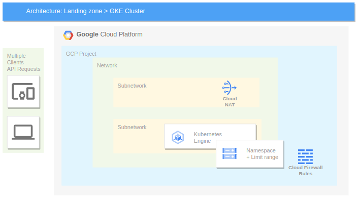

# GKE Autopilot cluster deployment demo

The Terraform code provided in this file serves as a foundation for creating a landing zone within the Google Cloud Platform (GCP) environment.

The code encompasses the orchestration of essential components, including the creation of a Google Cloud Project, establishment of the network infrastructure, and deployment of a Google Kubernetes Engine (GKE) cluster.i

Leveraging Infrastructure as Code (IaC) principles, this Terraform script ensures consistency, repeatability, and version control for the entire landing zone setup.

The modular structure of the code allows for easy customization and scalability, accommodating various configurations to meet specific project requirements. Whether deploying a new landing zone or updating an existing one, this Terraform code streamlines the process, providing a comprehensive and efficient solution for managing the GCP landing zone's foundational elements. Refer to the accompanying documentation for detailed instructions on utilizing and adapting the Terraform code to suit your organization's needs.

## Providers

| Name | Version |
|------|---------|
|  [google](#provider\_google) | 5.11.0 |
|  [kubernetes](#provider\_kubernetes) | 2.25.2 |
|  [random](#provider\_random) | 3.6.0 |

## Requirements

No requirements.

## Resources

| Name | Type |
|------|------|
| [google_compute_firewall.cloud-allow-internal](https://registry.terraform.io/providers/hashicorp/google/latest/docs/resources/compute_firewall) | resource |
| [google_compute_firewall.cloud-iap-tcp](https://registry.terraform.io/providers/hashicorp/google/latest/docs/resources/compute_firewall) | resource |
| [google_compute_firewall.cloud-icmp](https://registry.terraform.io/providers/hashicorp/google/latest/docs/resources/compute_firewall) | resource |
| [google_compute_network.network](https://registry.terraform.io/providers/hashicorp/google/latest/docs/resources/compute_network) | resource |
| [google_compute_router.router](https://registry.terraform.io/providers/hashicorp/google/latest/docs/resources/compute_router) | resource |
| [google_compute_router_nat.nat](https://registry.terraform.io/providers/hashicorp/google/latest/docs/resources/compute_router_nat) | resource |
| [google_compute_subnetwork.gke](https://registry.terraform.io/providers/hashicorp/google/latest/docs/resources/compute_subnetwork) | resource |
| [google_compute_subnetwork.nat](https://registry.terraform.io/providers/hashicorp/google/latest/docs/resources/compute_subnetwork) | resource |
| [google_container_cluster.cluster](https://registry.terraform.io/providers/hashicorp/google/latest/docs/resources/container_cluster) | resource |
| [google_project.project](https://registry.terraform.io/providers/hashicorp/google/latest/docs/resources/project) | resource |
| [google_project_service.compute](https://registry.terraform.io/providers/hashicorp/google/latest/docs/resources/project_service) | resource |
| [google_project_service.container](https://registry.terraform.io/providers/hashicorp/google/latest/docs/resources/project_service) | resource |
| [kubernetes_limit_range.example](https://registry.terraform.io/providers/hashicorp/kubernetes/latest/docs/resources/limit_range) | resource |
| [kubernetes_namespace.customer](https://registry.terraform.io/providers/hashicorp/kubernetes/latest/docs/resources/namespace) | resource |
| [random_string.project_id](https://registry.terraform.io/providers/hashicorp/random/latest/docs/resources/string) | resource |
| [google_client_config.default](https://registry.terraform.io/providers/hashicorp/google/latest/docs/data-sources/client_config) | data source |

## Inputs

| Name | Description | Type | Default | Required |
|------|-------------|------|---------|:--------:|
|  [billing\_account](#input\_billing\_account) | Billing account used by the GCP project | `string` | `"01097E-D138F9-1AE94C"` | no |
|  [env](#input\_env) | Environment name for the landing zone | `string` | n/a | yes |
|  [region](#input\_region) | Region used to deploy GCP resources | `string` | `"europe-west1"` | no |

## Outputs

No outputs.
